# 2026 First Half CVE Data Review

<!-- Featured image suggestion: graphs/00_scorecard.png (mid-year stat card) or graphs/01_cves_by_year.png (2026 towers over every prior H1) -->

We are halfway through 2026, so it is time for the mid-year CVE check-in. The short version: the volume curve has gone vertical while exploitation has not. This review covers everything published in the first half of 2026 (Jan 1 - Jun 30, 2026), the volume, the severity, what is actually being exploited, and who is driving the numbers, all measured against the same elapsed window a year ago so a partial half is never compared to a full one.

## TL;DR

**The first half of 2026 produced 35,238 CVEs, more in six months than any full year before 2024 (all of 2023 finished at 28,817).** That works out to one new CVE every **7.4 minutes**, an increase of **88.6%** over the same window in 2025 (18,684). And yet only **85 of them (0.24%)** have made CISA's KEV list so far, a floor that will rise as the cohort ages and exploitation is confirmed. That gap is the story of 2026 so far: we are minting CVEs faster than ever while confirmed exploitation stays rare, so the hard problem is signal-to-noise, not patch volume.

At this pace the year projects to roughly **71,060 to 80,526**, and the all-time catalog has now passed **338,661 CVEs** since 1999.

> **Note**: All statistics in this report exclude rejected CVEs to provide an accurate count of active vulnerabilities.

### Key Statistics at a Glance

| Metric | Value |
|--------|-------|
| **Total CVEs (H1 2026)** | **35,238** |
| CVEs per Day | 194.7 |
| Change vs same window 2025 | +88.6% |
| Projected Full Year | 71,060 - 80,526 |
| Critical Severity | 3,529 |
| High Severity | 13,757 |
| Average CVSS Score | 6.89 |
| CVSS Coverage | 94.2% |
| CWE Coverage | 95.4% |
| Active CNAs | 339 |
| Rejected CVEs (H1 2026) | 1,263 |
| Already Known-Exploited (KEV) | 85 |

---

## H1-over-H1: Three Years Side by Side

To keep the comparison honest while 2026 is still in progress, each year is measured over the identical window (January 1 through Jun 30).

| Window | CVEs | Per Day | Avg CVSS |
|--------|------|---------|----------|
| Jan 1 - Jun 30, 2024 | 20,374 | 112.6 | 6.65 |
| Jan 1 - Jun 30, 2025 | 18,684 | 103.2 | 6.56 |
| Jan 1 - Jun 30, 2026 | 35,238 | 194.7 | 6.89 |

---

## Forecast Scorecard: Are We On Pace?

At **194.7 CVEs/day**, two straight-line methods land close to each other (both are simple extrapolations of the same H1 run, so this is a sanity check, not two truly independent signals): the run-rate extrapolates to **71,060**, and a seasonality-adjusted estimate (scaling the pace across the full half, then dividing by 2025's 44% first-half share) to **80,526**.

[CVEForecast](https://www.cveforecast.org), one of my own RogoLabs tools, projects **82,875 CVEs** for full-year 2026 (LinearRegression, MAPE 14.35), so I am partly arguing with my own model here. That is **2,349 above** the top of the straight-line range, and here is where I will plant a flag: **I think the model is high.** Both simple extrapolations land near 80,526, and the forecast's entire gap to them rests on a heavy second-half surge that still has to show up. **My call is the year closes nearer 80,526 than 82,875.** I will happily eat those words in the December review if H2 accelerates the way the model expects, but the burden of proof is on the surge.

---

## What Changed in H1 2026

**GitHub Security Advisories** is the busiest CNA at **6,778** assignments. New to the most-affected product list this year: **OpenClaw, GitLab**. Among weakness types, [CWE-862](https://cwe.mitre.org/data/definitions/862.html) (Missing Authorization) climbed to #2 in the top five.

**Spotlight: OpenClaw.** A project that barely existed a year ago, OpenClaw (Peter Steinberger's viral local AI agent, the subject of [Lex Fridman Podcast #491](https://www.youtube.com/watch?v=YFjfBk8HI5o)) is already one of the most-reported products of the half with **537 CVEs**. The striking part is who is doing the reporting: **VulnCheck alone assigned 500** of them (93%), disclosed steadily across the half rather than in a single dump. That concentration says more about researcher attention than code quality: VulnCheck, whose remit is emerging and exploited-in-the-wild threats, is exactly the kind of team that systematically covers a fast-growing new target, and concentrated third-party research on a hot AI agent is the coverage you would want. To its credit the project embraced the CVE lifecycle itself, issuing advisories through GitHub as reports came in. I track its CVEs at [OpenClawCVEs](https://github.com/jgamblin/OpenClawCVEs).

---

## Historical CVE Growth

To compare like with like, this chart counts only the first half of every year (January 1 through Jun 30). On that basis 2026 already stands taller than any prior first half: more CVEs in six months than the same window has ever produced.

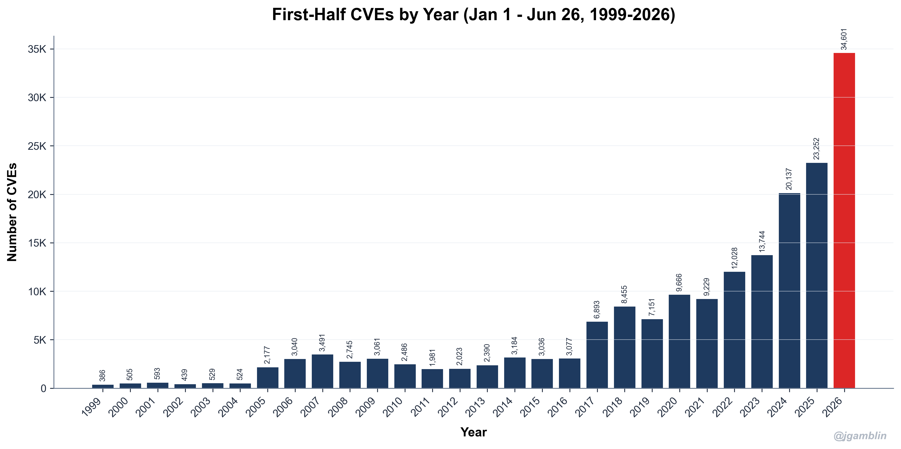

First-half growth has been relentless, and 2026 is **+88.6%** on the first half of 2025.

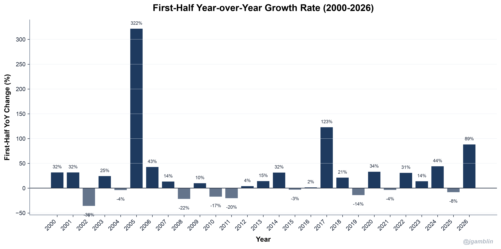

Counting full years, the cumulative catalog has now passed **338,661 CVEs**.

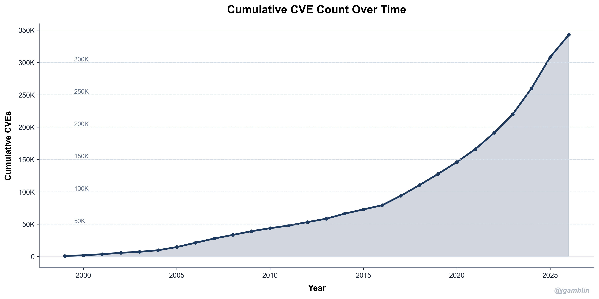

---

## Monthly Distribution (H1 2026)

CVE publications varied across the first half of 2026, with **Jun** being the peak month at **7,327 CVEs**.

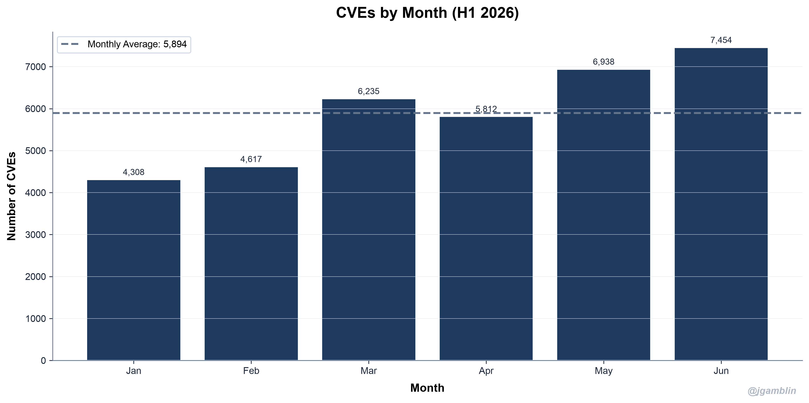

---

## Publication Patterns by Day of Week

Publishing clusters midweek. **Wednesday** is the busiest day at **7,943 CVEs**, with Tuesday close behind at **7,089**. Patch Tuesday is part of the story, but the midweek bulge owes as much to the high-volume CNAs (GitHub, Linux, the WordPress plugin crowd) that batch-publish midweek.

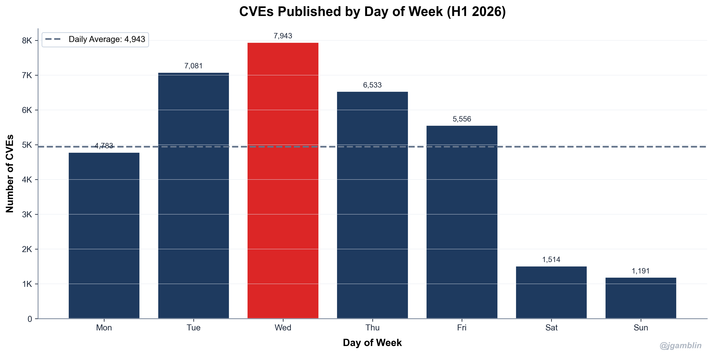

Weekdays average **6,492** CVEs against just **1,390** on weekends.

---

## Busiest Days of H1 2026

Some days saw massive spikes in CVE publications:

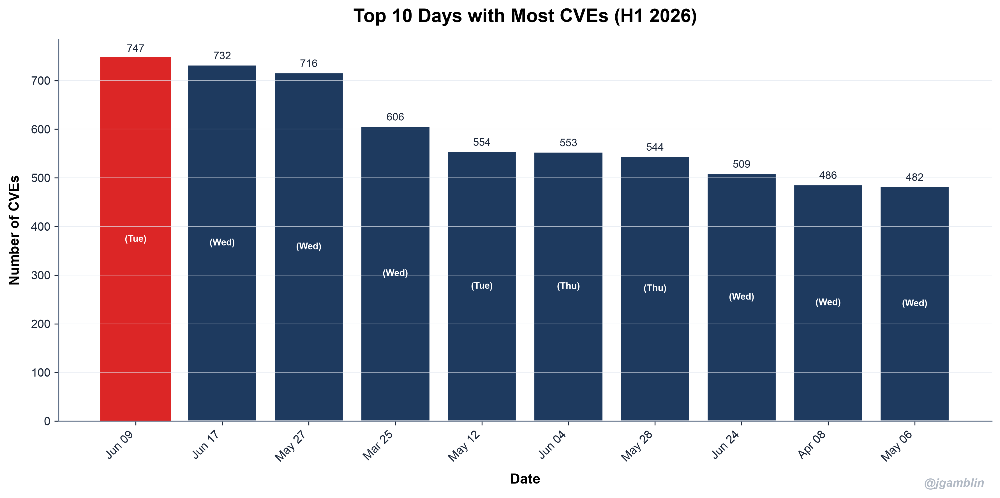

### Top 5 Busiest Days

| Rank | Date | CVE Count |
|------|------|----------|
| 1 | 2026-06-09 | 747 |
| 2 | 2026-06-17 | 732 |
| 3 | 2026-05-27 | 716 |
| 4 | 2026-03-25 | 606 |
| 5 | 2026-05-12 | 554 |

---

## CVSS Score Analysis

The Common Vulnerability Scoring System (CVSS) helps standardize severity assessments. Here's how H1 2026 CVEs were distributed across the scoring range.

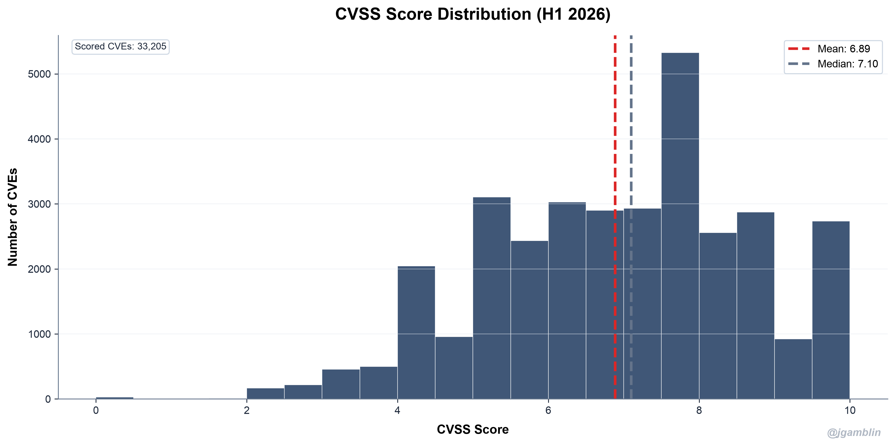

The **average CVSS score for H1 2026 was 6.89**, with a **median of 7.10**.

### Severity Breakdown

| Severity | Count | Percentage |
|----------|-------|------------|
| Critical | 3,529 | 10.0% |
| High | 13,757 | 39.0% |
| Medium | 14,429 | 40.9% |
| Low | 3,051 | 8.7% |
| Unscored | 472 | 1.3% |

Percentages are of all H1 2026 CVEs; "Unscored" are the 1.3% with no CVSS severity assigned.

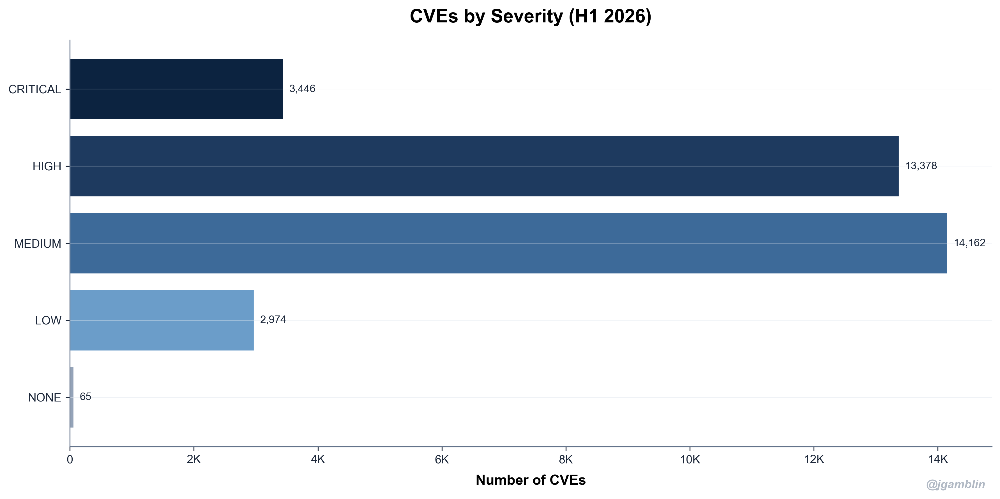

### CVSS Trends Over Time

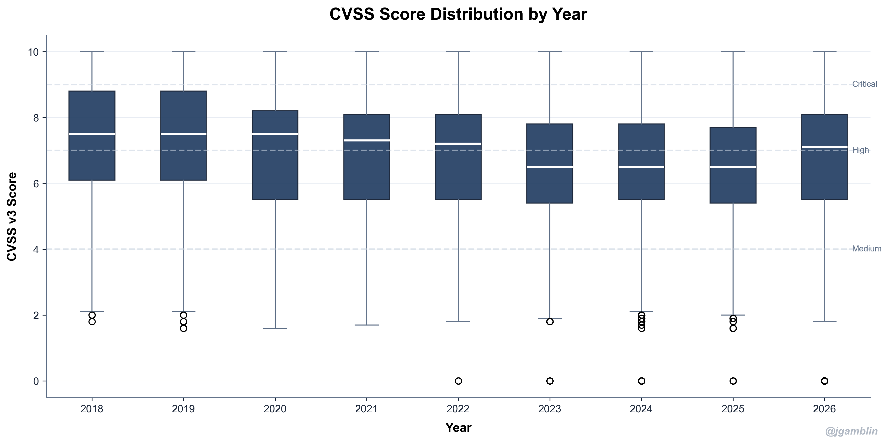

---

## Top Weakness Types (CWE)

The Common Weakness Enumeration (CWE) categorizes the types of security weaknesses. Here are the most prevalent weakness types in H1 2026:

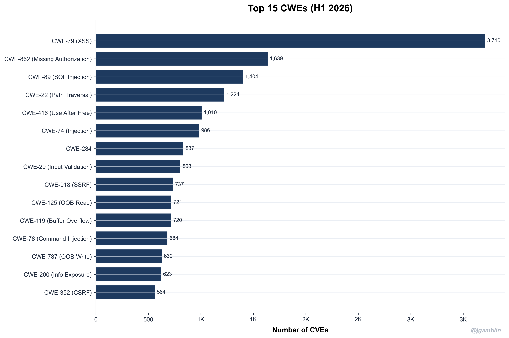

### Top 5 CWEs in H1 2026

| Rank | CWE | Name | Count |
|------|-----|------|-------|
| 1 | [CWE-79](https://cwe.mitre.org/data/definitions/79.html) | XSS | 3,774 |
| 2 | [CWE-862](https://cwe.mitre.org/data/definitions/862.html) | Missing Authorization | 1,697 |
| 3 | [CWE-89](https://cwe.mitre.org/data/definitions/89.html) | SQL Injection | 1,438 |
| 4 | [CWE-22](https://cwe.mitre.org/data/definitions/22.html) | Path Traversal | 1,255 |
| 5 | [CWE-416](https://cwe.mitre.org/data/definitions/416.html) | Use After Free | 1,035 |

---

## CVE Numbering Authorities (CNAs)

The leaderboard increasingly reflects where modern software and modern vulnerability research live: platform and ecosystem CNAs (GitHub, Patchstack) and dedicated research CNAs (VulnCheck, VulDB) alongside the traditional product vendors. High assignment counts are not inflation, a CNA covering the WordPress plugin ecosystem or issuing a CVE per kernel fix is doing exactly its job; the low KEV overlap below reflects how rare confirmed exploitation is across all sources, not the validity of any CNA's records. The most active assigners this year:

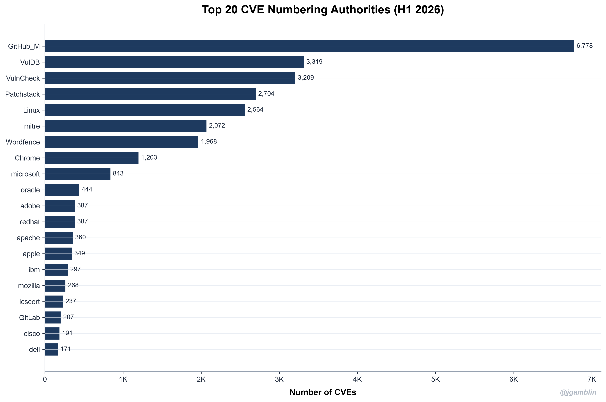

### Top 5 CNAs in H1 2026

| Rank | CNA | CVEs Assigned |
|------|-----|---------------|
| 1 | GitHub Security Advisories | 6,778 |
| 2 | VulDB | 3,319 |
| 3 | VulnCheck | 3,209 |
| 4 | Patchstack | 2,704 |
| 5 | Linux | 2,564 |

In total, **339 unique CNAs** assigned CVEs in H1 2026.

---

## Top Vendors

The vendors with the most CVEs attributed to their products this year (each links to its NVD search):

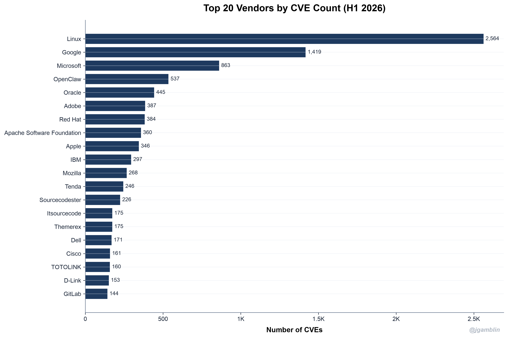

### Top 5 Vendors in H1 2026

| Rank | Vendor | CVE Count |
|------|--------|-----------|
| 1 | [Linux](https://nvd.nist.gov/vuln/search/results?form_type=Advanced&results_type=overview&search_type=all&isCpeNameSearch=false&cpe_vendor=linux) | 2,564 |
| 2 | [Google](https://nvd.nist.gov/vuln/search/results?form_type=Advanced&results_type=overview&search_type=all&isCpeNameSearch=false&cpe_vendor=google) | 1,419 |
| 3 | [Microsoft](https://nvd.nist.gov/vuln/search/results?form_type=Advanced&results_type=overview&search_type=all&isCpeNameSearch=false&cpe_vendor=microsoft) | 863 |
| 4 | [OpenClaw](https://nvd.nist.gov/vuln/search/results?form_type=Advanced&results_type=overview&search_type=all&isCpeNameSearch=false&cpe_vendor=openclaw) | 537 |
| 5 | [Oracle](https://nvd.nist.gov/vuln/search/results?form_type=Advanced&results_type=overview&search_type=all&isCpeNameSearch=false&cpe_vendor=oracle+corporation) | 445 |

---

## Most Vulnerable Products

Drilling past vendors to specific products, the H1 2026 leaders:

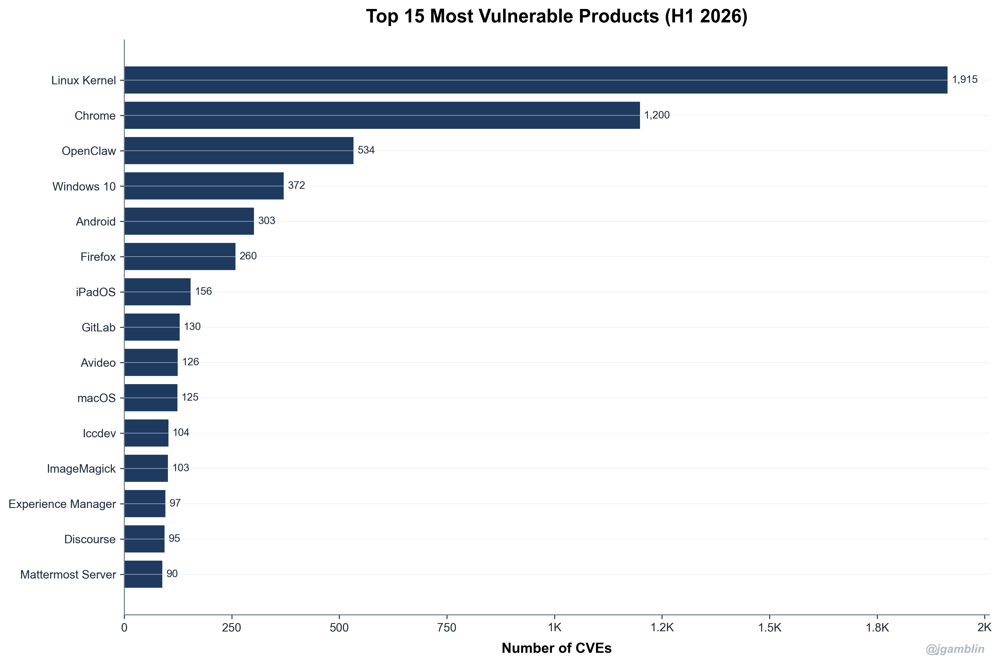

### Top 5 Products

| Rank | Product | CVE Count |
|------|---------|----------|
| 1 | Linux Kernel | 1,955 |
| 2 | Chrome | 1,203 |
| 3 | OpenClaw | 534 |
| 4 | Windows 10 | 372 |
| 5 | Android | 303 |

Product-level counts can differ slightly from the vendor totals above: a vendor's CVEs may span several products, and a single CVE can name more than one.

---

## Known-Exploited Vulnerabilities (CISA KEV)

Volume is the headline, but exploitation is what should actually drive patching. Of the **35,238** CVEs published in H1 2026, only **85** (0.24%) have shown up in the [CISA KEV catalog](https://www.cisa.gov/known-exploited-vulnerabilities-catalog) so far. Treat that as a floor, not a verdict: KEV is a US-government catalog that lags disclosure by months and records only confirmed, observed exploitation, so this share will climb as the 2026 cohort ages. Even so, the signal holds, most CVEs are not known-exploited, so exploitability (KEV plus a forward-looking score like EPSS) beats chasing raw counts.

Note these are two different populations: the **85** above are H1-2026-*published* CVEs already in KEV, while CISA *added* **146** entries to KEV during the half (more than the **132** added in the same window of 2025, many of them older CVEs newly exploited), and **17** of those additions are tied to known ransomware campaigns.

### H1 2026 CVEs Already in KEV

A sample (first 5 of 85, earliest additions first):

| CVE | Vendor | Product | Added | Ransomware |
|-----|--------|---------|-------|------------|
| CVE-2026-20805 | Microsoft | Windows | 2026-01-13 | No |
| CVE-2026-20045 | Cisco | Unified Communications Manager | 2026-01-21 | No |
| CVE-2026-24061 | Gnu | InetUtils | 2026-01-26 | No |
| CVE-2026-21509 | Microsoft | Office | 2026-01-26 | No |
| CVE-2026-23760 | Smartertools | SmarterMail | 2026-01-26 | Yes |

---

## Data Quality

Not all CVEs have complete metadata. Here's how data quality has evolved over the years:

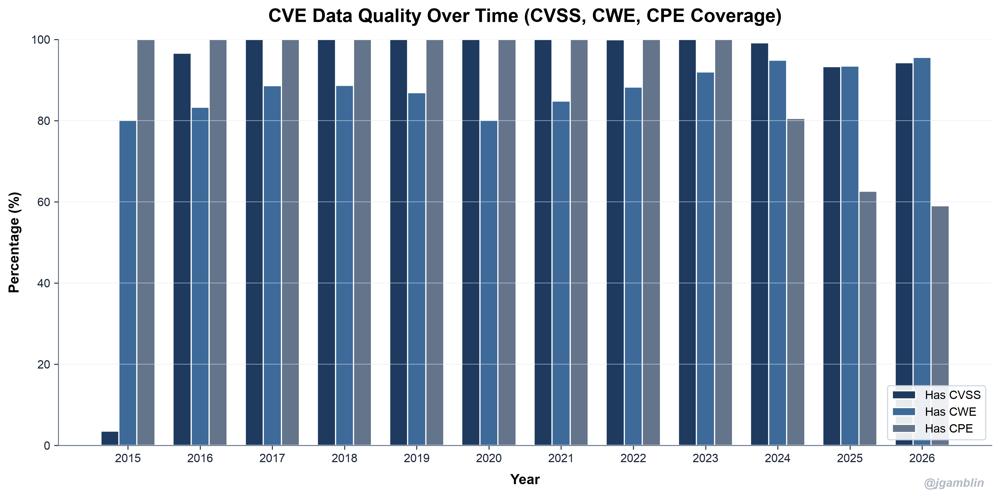

### H1 2026 Data Quality Metrics

| Metric | Coverage |
|--------|----------|
| CVSS Score | 94.2% |
| CWE Classification | 95.4% |
| CPE Identifiers | 58.9% |

This is where two ideas from the *CVE Decaf* work I did with Jay Jacobs get practical: **actionable data quality** (judge a record by whether it is complete enough to act on, not by abstract completeness) and **data provenance** (knowing which source asserted each field). The CPE gap is the clearest case. At **58.9% CPE coverage**, nearly half of H1 2026 CVEs cannot be automatically matched to a product the day they publish, so for those records the answer to "can I act on this today?" is no, no matter how complete the rest of the entry looks. Scoring each record on its provenance (who supplied it) and on the fields that actually drive action (CPE for asset matching, KEV and EPSS for exploitability) is how you turn the raw feed into a measurable signal-to-noise ratio instead of a flat backlog.

---

## Rejected CVEs

Not all CVE IDs stay active. Some are rejected for duplicates, disputes, or invalid submissions, and the rejection rate is a useful read on the ecosystem's quality control.

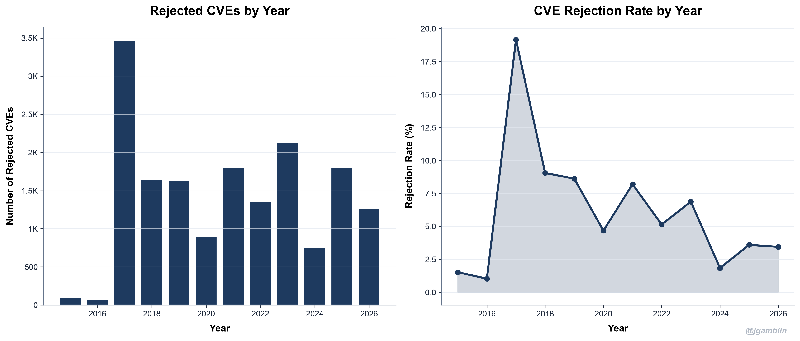

### H1 2026 Rejection Statistics

| Metric | Value |
|--------|-------|
| Rejected CVEs in H1 2026 | 1,263 |
| H1 2026 Rejection Rate | 3.46% |
| Total Rejected (All Time) | 17,361 |

CVE rejections occur for several reasons:
- **Duplicates**: The same vulnerability assigned multiple CVE IDs
- **Disputes**: Vendor disagreement that the issue is a vulnerability
- **Invalid**: Not a security vulnerability or insufficient information
- **Withdrawn**: CVE withdrawn by the assigning CNA

---

## Conclusions

### Key Takeaways from the First Half of 2026

1. **Volume keeps climbing**: 35,238 CVEs in roughly six months, up 88.6% on the same window last year, with the full year projecting to 71,060-80,526.

2. **Severity stays heavy**: 17,286 CVEs (49.1%) are Critical or High.

3. **Web and access-control flaws lead**: XSS, Missing Authorization, SQL Injection, Path Traversal headline the CWE list. Memory-safety issues barely register in the top tier this half.

4. **The CNA mix is shifting**: platform teams and aggregators, not the original vendors, now top the assigner list, and the lineup reshuffled from a year ago.

5. **Coverage gaps persist**: CVSS and CWE are well covered, but CPE sits at 58.9%, which still hampers automated matching.

6. **Confirmed exploitation stays rare (so far)**: just 85 of 35,238 H1 CVEs (0.24%) are in CISA KEV today, a floor that rises as the cohort ages. Volume is a triage problem, not a patch-everything problem.

### What this means for you

- **If you defend a network:** do not let the raw count set your pace. Only **0.24%** of H1 CVEs are confirmed-exploited in KEV today, but KEV lags and is a floor, not the full risk picture. Lead with exploitability (KEV as a hard floor, EPSS with a threshold you pick), then weight by your own context: internet-facing and sensitive systems jump the queue regardless of score, and compliance SLAs (PCI, FedRAMP, and the like) still set hard clocks. Lower priority is not never, so park the rest in a managed cycle rather than ignoring it.
- **If you run a CNA:** the leaderboard now runs through platforms, ecosystems, and research CNAs. Volume reflects scope, not padding; the differentiator that is still genuinely uneven is data quality, and the biggest gap, CPE coverage, is largely an NVD-side enrichment problem rather than a function of who assigned the CVE.
- **If you consume NVD data:** enrichment is the bottleneck. CPE at 58.9% means nearly half of new CVEs lack a formal CPE, which complicates NVD-style automated matching (many CNAs still carry vendor/product strings), and volume only widens that gap.

### What I'm watching in H2

My call from the scorecard stands: 2026 closes nearer **80,526** than the **82,875** forecast. Two things would change my mind: a December disclosure surge bigger than 2025's, or another OpenClaw-style project flooding the catalog. The year-end review settles it.

---

## Methodology and Reproducibility

Two primary data sources, plus two enrichment feeds:

1. **NVD JSON** - National Vulnerability Database export from [nvd.handsonhacking.org](https://nvd.handsonhacking.org/nvd.json)
2. **CVE List V5** - Official CVE records from [CVEProject/cvelistV5](https://github.com/CVEProject/cvelistV5)
3. **Forecast** - [CVEForecast](https://www.cveforecast.org) full-year projection
4. **Exploitation** - [CISA KEV catalog](https://www.cisa.gov/known-exploited-vulnerabilities-catalog)

Everything here is reproducible. The full pipeline (Python, pandas, matplotlib) is on GitHub at [jgamblin/H12026CVEBlog](https://github.com/jgamblin/H12026CVEBlog), and it leans on the free CVE tooling I build at [RogoLabs](https://rogolabs.net): [cve.icu](https://cve.icu), [cnascorecard.org](https://cnascorecard.org), and [cveforecast.org](https://www.cveforecast.org).

*Data collected and analyzed on June 30, 2026.*
